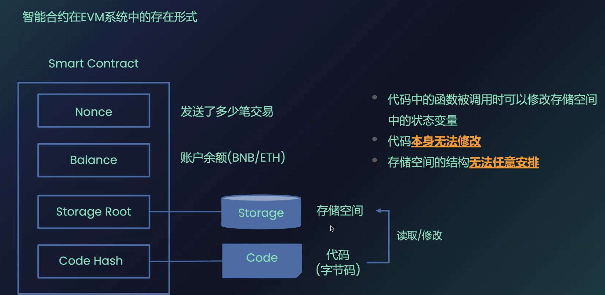
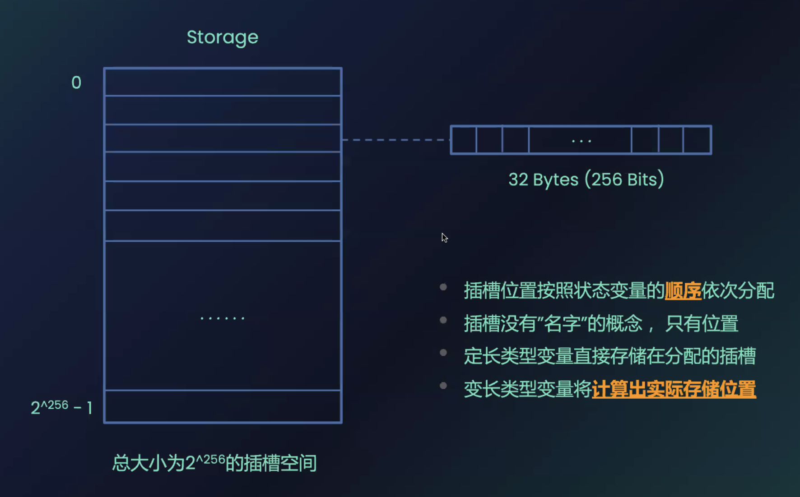
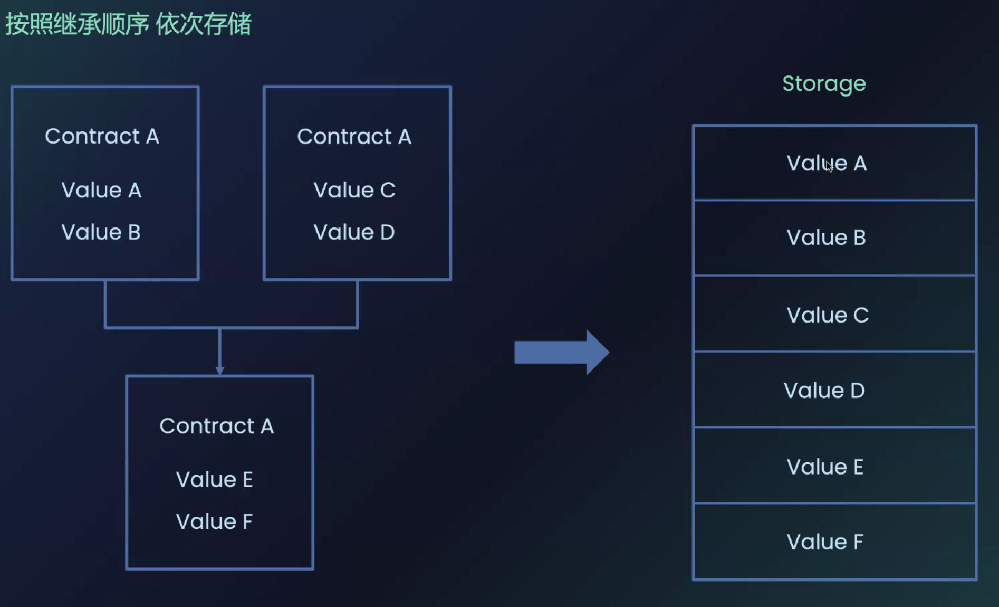

# Vault

## Reference
[Vault](https://ethernaut.openzeppelin.com/level/8)

[Vault.sol](https://github.com/yuhuajing/ethernaut-book/blob/main/src/08-Vault/Vault.sol)

[Slot存储](https://docs.soliditylang.org/en/latest/internals/layout_in_storage.html)

[GolangSlot](https://github.com/yuhuajing/getSCSlotData/tree/main)

## 目标
1. 解锁当前合约

## 分析
### unlock
1. unlock()函数用于解锁当前合约
2. unlock()需要 password 参数
```solidity
    function unlock(bytes32 _password) public {
        if (password == _password) {
            locked = false;
        }
    }
```
3. 合约内部的参数存储：
```solidity
    bool public locked;
    bytes32 private password;
```
4. password合约参数修饰符为private，表明隐藏数据，在该合约中不可直接读取
   1. 合约数据存储上链后即公开，已经按照合约定义的参数顺序存储在当前合约storage
   2. 按照slot顺序，可以读出任何定义在合约中的参数值

## Slot storage



