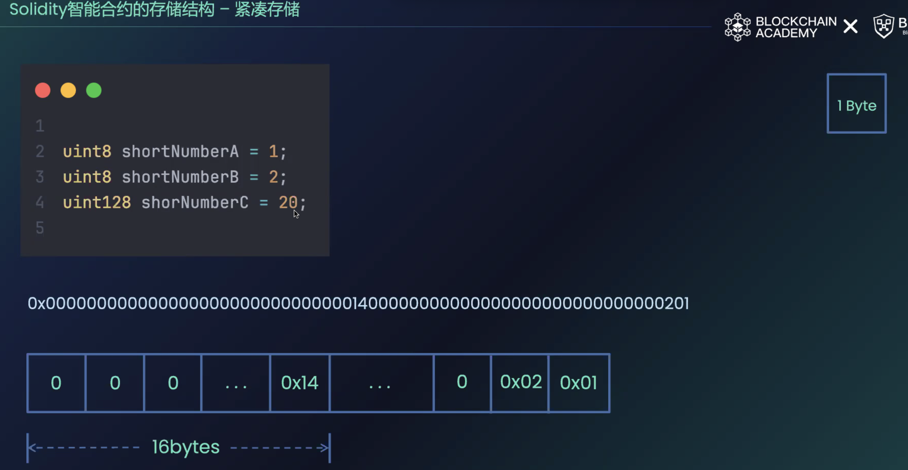
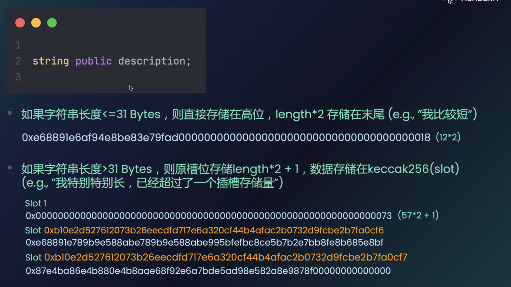
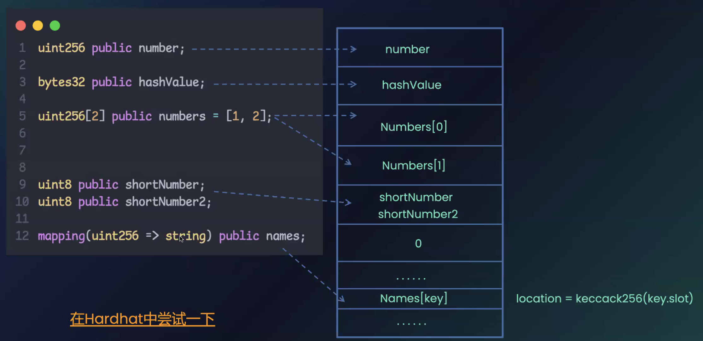

# Privacy
## Reference
[Privacy](https://ethernaut.openzeppelin.com/level/12)

[Privacy.sol](https://github.com/yuhuajing/ethernaut-book/blob/main/src/12-Privacy/Privacy.sol)

[Slot存储](https://docs.soliditylang.org/en/latest/internals/layout_in_storage.html)

[GolangSlot](https://github.com/yuhuajing/getSCSlotData/tree/main)

## 目标
1. 找出链上Private数据

## slot存储
### 整数
整数数据从低位开始存储，拼凑的参数进入高位

### string
string 从高位存储，地位存储长度

### structs and arrays
结构体类型和固定大小的数组类型，内部的参数都会按照全局参数顺序存储在的slot栈中
### Dynamic Arrays
1. 动态数组具体数据存储的起始位置为：`keccak256(p)`,p为当前slot的index,内部存储数组size
2. 动态数组的数据存储按照拼凑规则，不足128bit的会拼接在同一个slot中存储
3. 二元数组的存储起点：keccak256(keccak256(p) + i) + floor(j / floor(256 / 24))

### Mappings
1. 对于key-value的mapping,按照key类型和slot位置计算存储位置的slot：`keccak256(h(k) . p)`
### Examples
```solidity
// SPDX-License-Identifier: GPL-3.0
pragma solidity >=0.4.0 <0.9.0;


contract C {
struct S { uint16 a; uint16 b; uint256 c; }
uint x; // slot0
mapping(uint => mapping(uint => S)) data; // slot1
}
```
1. 找出 data[4][9].c的存储位置
2. data的slot顺序为 slot1
3. data[4]的存储slot为 `keccak256(uint256(4) . uint256(1))`
4. data[4][9]的存储slot为 `keccak256(uint256(9) . keccak256(uint256(4) . uint256(1))`
5. 结构体内参数按照参数类型存储，其中 a,b 存储在同个slot, c存储在下一个slot
6. data[4][9].c的存储slot为 `keccak256(uint256(9) . keccak256(uint256(4) . uint256(1)) + 1`

## 实现步骤
1. [golang读取Slot数据](https://github.com/yuhuajing/getSCSlotData/tree/main)
