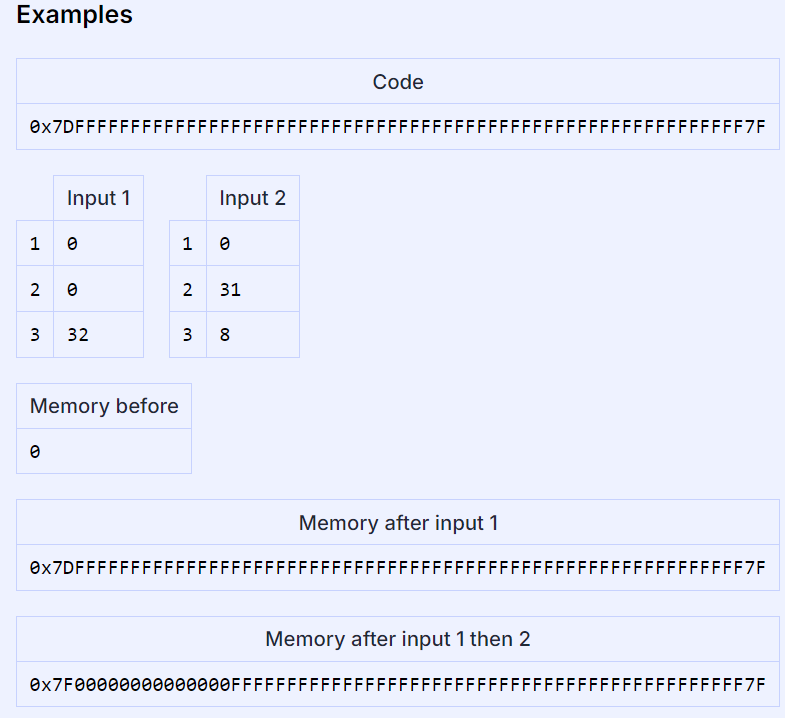
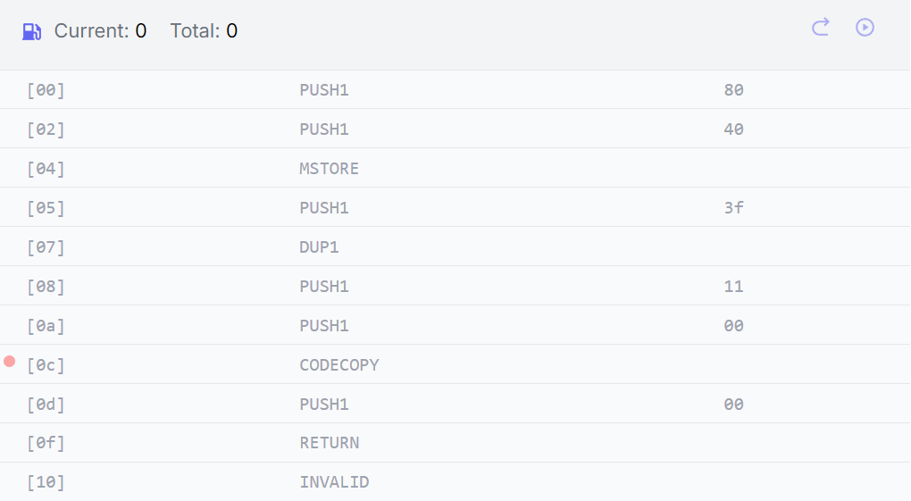

# GateKeeperTwo

## Reference
[GateKeeperTwo](https://ethernaut.openzeppelin.com/level/14)

[GateKeeperTwo.sol](https://github.com/yuhuajing/ethernaut-book/blob/main/src/14-GatekeeperTwo/GatekeeperTwo.sol)

[Ethereum-Creation-Code](https://www.rareskills.io/post/ethereum-contract-creation-code)

[//]: # ([Security]&#40;https://blog.dixitaditya.com/&#41;)

## 目标
1. 更新目标合约的参数

## Ethereum smart contract creation code
### codeCopy
[codecopy](https://www.evm.codes/?fork=cancun#39)从内存中取出数据
1. `destOffset`: 内存中读取数据的起始位置
2. `offset`: 待拷贝数据的起始位置
3. `size`: 拷贝数据的长度



### Introduction-creation code
`<init code> <runtime code> <constructor parameters>`
1. 合约部署时由三部分组成: `EVM` 从`init code`开始执行部署工作（`create` 字节码），部署过程初始化构造器参数并且将 `runtime code`存储在链上
```solidity
pragma solidity 0.8.17;// optimizer: 200 runs
contract Minimal {
    // 空 constructor()函数不影响合约部署的字节码，存在或不存在 constructor()函数，字节码都一样
    constructor() payable {

    }
}
```
部署 bytesCode
`0x6080604052603f8060116000396000f3fe` + `6080604052600080fdfea2646970667358221220a4c95008952415576a18240f5049a47507e1658565a8ec11a634c25a9aa17cf164736f6c63430008110033`


1. `initcode`中执行`codecopy`,栈内数据自栈顶向下依次存在值：`00,11,3f,3f`。表明从内存 `0index`开始，间隔 `0x11=17`开始读取 `0x3f=63bytes`数据
2. `codecopy`将`runtimeCode`拷贝到内存中存储
3. `return`关键字将内存数据返回到`EVM`，作为合约数据存储上链

### Non-payable constructor contract
`0x6080604052348015600f57600080fd5b50603f80601d6000396000f3fe`|`6080604052600080fdfea2646970667358221220a55361e0436e97c9dd60ac5f5a5d96e6a000f6229fd071b0bc9ab6d5f7fe2fe064736f6c63430008110033`

包含`payable` 修饰符的合约：
`0x6080604052603f8060116000396000f3fe`+`6080604052600080fdfea2646970667358221220a4c95008952415576a18240f5049a47507e1658565a8ec11a634c25a9aa17cf164736f6c63430008110033`
1. 没有payable修饰的合约部署代码中的`initcode size`较大，因为需要进行value的判断
2. `<init bytecode> <extra 12 byte sequence (payable case)> <return runtime bytecode> <runtime bytecode>`
```solidity
// check the amount of wei that was sent
CALLVALUE
DUP1
ISZERO

// Jump to 0x0f (contract deployment step)
PUSH1 0x0f
JUMPI

// revert if wei sent is greater than 0
PUSH1 0x00
DUP1
REVERT
```
 
### RuntimeCode
1. 在空合约中，`runtimeCode`不为空，需要包含当前合约编译环境等源数据
2. `runtimeTime`包含 `constructor()`构造函数中的初始化参数(如果存在的话，会`encode`到最后)

```solidity
pragma solidity 0.8.17;
contract Runtime {
    address lastSender;
    constructor () payable {}

    receive() external payable {
        lastSender = msg.sender;
    }
}
```
存在函数方法的合约的部署字节码：`0x6080604052605a8060116000396000f3fe`+`608060405236601f57600080546001600160a01b03191633908117909155005b600080fdfe`+`a2646970667358221220f866e014c98dd6fc08f86a965441844c3b59b2562df6b35744699f67785c2a0c64736f6c63430008110033`
1. `<initCode> + <Runtimecode>(part1_runtimeCode + part2_Metadata)`
2. `runtimeCode`负责处理 `msg.data`, 遍历字节码匹配合约函数进行处理。示例不存在任何函数以及`fallback()`函数，如果用于发起的交易中`msg.data`不为空的话，会导致交易`revert`.

### Constructor with parameters
1. 构造函数的数据用于初始化合约函数，在合约代码存储上链后执行。
2. 存在参数的构造函数，在部署时会检查合约参数是否时预期参数类型、长度等
3. 构造函数参数`encode`到`runtimeCode`之后

```solidity
pragma solidity 0.8.17;
contract MinimalLogic {
	uint256 private x;
	constructor (uint256 _x) payable {
		x =_x;
	}
}
```
合约部署字节码： `0x608060405260405160893803806089833981016040819052601e916025565b600055603d565b600060208284031215603657600080fd5b5051919050565b603f80604a6000396000f3fe`+ `6080604052600080fdfea26469706673582212209e3f4fd87589fae7c00e7284adf0a1a3f48c201e7bbaed31395c5304a13054a764736f6c63430008110033` + `000000000000000000000000000000000000000000000000000000000000007b`
1. 部署环节先检查构造函数的参数是否符合预期
2. 检查通过后，更新合约`storage`参数
3. 将`runtimecode`拷贝的内存并存储上链

## 合约分析
1. `msg.sender != tx.origin` ，需要实现一个辅助攻击合约，通过合约`call`，更新当前交易的 `msg.sender`
2. `extcodesize(caller()) ==0` 要求发起交易的合约的`runtimeCode`为空
   1. 合约部署过程会先执行 构造函数中的逻辑，然后才会返回`runtimecode`并存储上链
   2. 因此如果远程`call`的合约逻辑放在 `constructor()` 函数中执行, 就可以满足这个条件
3. 对于异或操作 `A XOR B = C` 等于`A XOR C = B`, 所以 `key` 值等于 `A XOR C`
```solidity
contract AtGatekeeper {
   bytes8 gateKey = bytes8(uint64(bytes8(keccak256(abi.encodePacked(address(this)))))  ^ type(uint64).max);
   constructor() {
      GatekeeperTwo two = GatekeeperTwo(0xxxxxxxxx);
      two.enter(gateKey);
   }
   function anyfunc()public {}
   function anyfunc2()public {}
}
```
